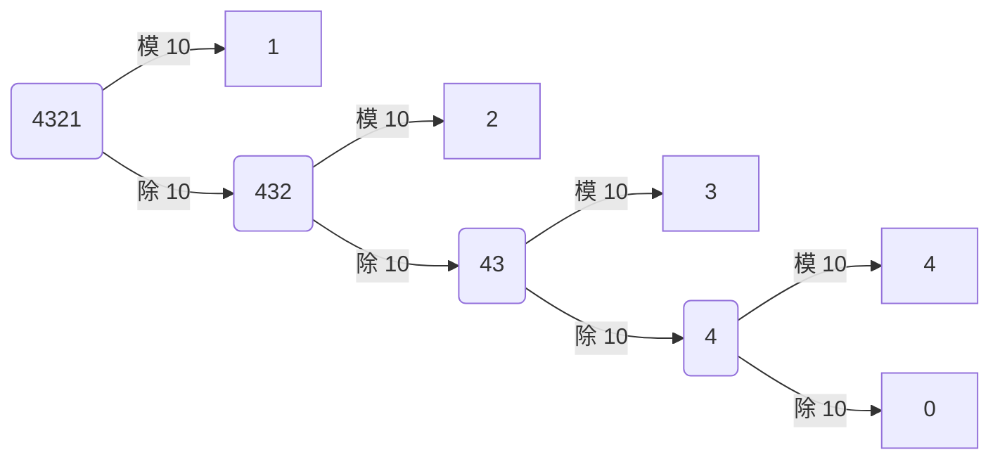
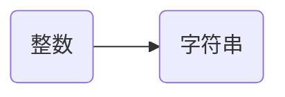

# 数位拆分

::: info 简介

「数位拆分」即把一个数的每一位数字拆分出来，以方便我们后续操作。例如整数 4321，它的千位数字为 4，百位数字为 3，十位数字为 2，个位数字为 1。

那么，如何通过编码取得一个整数的每一位数字呢？常见的办法有两种：

- 模运算 + 除法运算。
- 整数转换字符串。

:::

## 一、模运算+除法运算

以 $4321$ 为例：



- $4321 \% 10 = 1$，得到个位上的数字 $1$；$4321 \div 10 = 432$（只保留整数部分）。
- $432 \% 10 = 2$，得到十位上的数字 $2$；$432 \div 10 = 43$。
- $43 \% 10 = 3$，得到百位上的数字 $3$；$43\div 10 = 4$。
- $4 \% 10 = 4$，得到千位上的数字 $4$；$4 \div 10 = 0$（结束操作）。

如上所示，通过不断的模 $10$ 、 除 $10$，我们就可以依次得到一个整数的个位，十位，百位，千位，$\dots$

::: code-tabs

@tab C++

```cpp
void work(int n){
	while(n){
    cout << n % 10 << '\n'; // 从低位到高位依次输出 n 每一个位上的数字
    n /= 10;
  }  
}
```

@tab Java

```java
public static void work(int n){
  while(n > 0){
  	System.out.println(n % 10);
    n /= 10;
  }
}
```

@tab:active Python

```python
def work(n):
  while n > 0:
    print(n % 10)
    n //= 10  # 在 python 中 "//" 符号表示取整 
```

:::

> 运行举例说明：
>
> - 向 `work()` 函数传入参数 $54321$，程序会输出：
>
> ```text
> 1
> 2
> 3
> 4
> 5
> ```
>
> - 向 `work()` 函数输入参数 `8935216`，程序会输出：
>
> ```text
> 6
> 1
> 2
> 5
> 3
> 9
> 8
> ```
>
> 

## 二、 整数转换字符串

*字符串在存储上类似字符数组，所以它每一位的单个元素都是可以提取的*。对此，我们可以使用语言自带的整数转字符串函数，将整数转换为字符串。转换为字符串后，字符串的每一位即对应整数的每一位数字。



::: code-tabs

@tab C++

```cpp
void work(int n){
	string s = to_string(n); // to_string() 的作用是将传入的整数转换为字符串。
  // 注意：s[0] 表示 n 最高位上的数字，s[s.size() - 1] 表示是 n 个位上的数字 
  for(auto i : s) cout << i << '\n';
}
```

:::

> 运行举例说明：
>
> - 向 `work()` 函数传入参数 $54321$，程序会输出：
>
> ```text
> 5
> 4
> 3
> 2
> 1
> ```
>
> - 向 `work()` 函数输入参数 $8935216$，程序会输出：
>
> ```text
> 8
> 9
> 3
> 5
> 2
> 1
> 6
> ```

