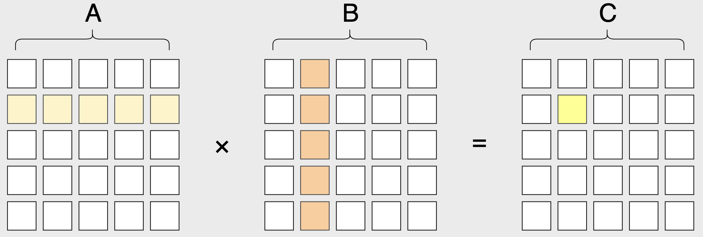

## 一、幂

::: info 简介

幂指乘方运算的结果。

$a^n$ 指 $n$ 个 $a$ 相乘：
$$
a^n = \underbrace{a \times a \times \cdots \times a}_{n}
$$
把 $a^n$ 看作乘方的结果，叫做 $a$ 的 $n$ 次幂。

:::


### 1.1 幂的计算

可直接根据幂的定义，暴力求解。时间复杂度为 $O(n)$。

::: code-tabs

@tab C++

```cpp
int work(int a , int n){
  int ans = 1;
  for(int i = 1 ; i <= n ; i ++) ans *= a;
  return ans;
}
```
:::

> 运行举例说明：
>
> - `work(2 , 5)` 返回的结果为：
>
> ```tex
> 32
> ```
>
> - `work(5 , 2)` 返回的结果为：
>
> ```tex
> 25
> ```

幂增长（指数增长）的速度是极快的，因此其计算的结果是极大的。

在 C++ 中：

+ `int` 的数据范围是 $-2^{31} \sim 2^{31} - 1$；
+ `long long` 的数据范围是 $-2^{63} \sim 2^{63}-1$；
+ `unsigned long long` 的数据范围是 $0\sim 2^{64}$；
+ `__int128` 的数据范围是 $-2^{127} \sim 2^{127}-1$。

显然，这样的数据范围对于幂计算而言根本不够用。因此，当 $a,n$ 的数据范围较大时，我们就无法使用整型变量来存储、计算幂了。

为了避免这个问题，题目通常会给出一个固定模数 $p$（如常见的 `1000000007`，`998244353` 等），并让我们将幂的计算结果模上 $p$ 后作为答案。

::: code-tabs

@tab C++

```cpp
int work(int a , int n , int p){
  int ans = 1;
  a %= p;
  for(int i = 1 ; i <= n ; i ++) ans = ans * a % p;
  return ans;
}
```
:::

> 运行举例说明：
>
> - `work(2 , 5 , 998244353)` 返回的结果为：
>
> ```tex
> 32
> ```
>
> - `work(123 , 666 , 233)` 返回的结果为：
>
> ```tex
> 58
> ```

### 1.2 pow() 函数

`pow()` 函数是 C++ 自带的数学函数，用于进行求幂运算。

使用方法：
$$
pow(a , n)
$$
返回结果：
$$
a^n
$$

> 运行举例说明：
>
> - `pow(2 , 5)`，返回的结果为：
>
> ```tex
> 32
> ```
>
> - `pow(5 , 2)`，返回的结果为：
>
> ```tex
> 25
> ```

`pow()` 函数还能进行一些更为精妙的运算。

>运行举例说明：
>
>- 求平方根。`pow(4 , 0.5)`，返回的结果为：
>
> ```tex
> 2
> ```
>
>- 求立方根。`pow(8 , 1.0 / 3)`，返回的结果为：
>
> ```tex
> 2
> ```
>
>$\cdots$

> [!warning] 
>
> `pow()` 函数的时间复杂度同样为 $O(n)$，与手写相比它可以处理更为复杂的幂运算。但并不推荐大家在算法竞赛中使用 `pow()` 函数，原因有两点：
>
> 1. 它存在很多精度问题上的坑点，容易踩坑；
> 2. 它无法结合模运算。

## 二、快速幂

在前文中，我们提到，当 $a$ 和 $n$ 较大时，题目（通常）会提供一个固定的模数来解决计算结果过大、整型变量无法存储的问题。然而，这只是解决了存储问题，并没有解决时间、效率上的问题。

如果我们现在要求 $2^{9876543210} \bmod (10^9+7)$ 的结果，那么显然，一个时间复杂度为 $O(n)$ 的算法在有限的时间内是无法解决的。

于是，快速幂它来了。

:::info 简介

快速幂是一种用于计算幂的高效算法，它求解 $a^n$ 所需的时间复杂度为 $O(\log_2n)$。

:::

### 2.1 快速幂的原理

**快速幂的基本思想是对幂进行二进制分解，然后依次计算每一位对应的乘方，以减少计算次数。**

举个例子，假设我们要计算 $5^{11}$，那么我们可以先将 $11$ 表示成二进制的形式，即：
$$
(11)_{10}=(1011)_2 = 1\times 2^3+0\times 2^2+1\times 2^1+1\times 2^0
$$
接着，用 $1\times 2^3+0\times 2^2+1\times 2^1+1\times 2^0$ 替换 $11$ 得到：
$$
\begin{equation}
\begin{aligned}
5^{11}&=5^{1\times 2^3+0\times 2^2+1\times 2^1+1\times 2^0}\\
&=5^{2^3}\times 5^{0\times 2^2}\times 5^{2^1}\times 5^{2^0}\\
&=5^8\times 5^0\times 5^2\times 5^1 \\
&=5^8\times 1 \times 5^2 \times 5^1 \\
&=48828125
\end{aligned}
\end{equation}
$$
这就是快速幂算法的原理。

### 2.2 快速幂的实现

根据快速幂的原理，我们可以将快速幂 $a^n$ 的实现分为两个步骤：

1. 对幂 $n$ 进行二进制分解；
2. 将二进制表示的每一位对应的乘方累乘到结果中。

> [!tip]
>
> 对于 $n$ 在二进制下的第 $i$ 位：
>
> + 若其值为 $1$，则对应的乘方为 $a^{1\times 2^{i-1}} = a^{2^{i - 1}}$，我们需要将结果乘以 $a^{2^{i-1}}$；
> + 若其值为 $0$，则对应的乘方为 $a^{0\times 2^{i-1}} = 1$，将结果乘 $1$ 属于无效操作，因此不进行操作。 
>
> 根据乘方分配律，我们有：
> $$
> a^{2^i} = a^{2^{i-1} \times 2} = (a^{2^{i-1}})^2 = ((a^{2^{i-2}})^2)^2 = \cdots
> $$
> 于是，我们可以维护一个变量 $x$，在计算第 $i$ 位的乘方时，$x = a^{2^{i-1}}$，在计算第 $i+1$ 位的乘方时，令 $x = x \times x$，使得 $x = a^{2^i}$。这样，我们就可以边对 $n$ 进行二进制分解，边计算 $n$ 在二进制下第 $i$ 位对应的乘方。
>
> :::note 以 5 的 11 次幂为例（从低位往高位逐步操作）
>
> - 二进制的值依次为 ：$1$，$1$，$0$，$1$。
> - 乘方的值依次为：$5^1$，$5^2$，$1$，$5^8$。
> - $x$ 的值依次为：$5$，$5^2$，$5^4$，$5^8$。
>
> |           二进制第 $4$ 位            |         二进制第 $3$ 位          |           二进制第 $2$ 位            |           二进制第 $1$ 位            |
> | :----------------------------------: | :------------------------------: | :----------------------------------: | :----------------------------------: |
> |                  1                   |                0                 |                  1                   |                  1                   |
> | $5^{1\times 2^{4-1}}= 5^{2^3} = 5^8$ | $5^{0\times 2^{3-1}}= 5^{0} = 1$ | $5^{1\times 2^{2-1}}= 5^{2^1} = 5^2$ | $5^{1\times 2^{1-1}}= 5^{2^0} = 5^1$ |
> |        $x = x\times x = 5^8$         |      $x = x\times x = 5^4$       |        $x = x\times x = 5^2$         |               $x = 5$                |
>
> :::

下面让我们将把快速幂的实现拆解为三个步骤，以便于理解。

#### 步骤1：对幂进行二进制分解

::: code-tabs

@tab C++

```cpp
void work(int a , int n , int p){
  while(n > 0){
    cout << (n & 1); // n & 1 相当于 n % 2
    n >>= 1;         // n >>= 1 相当于 n /= 2
  } 
}
```
:::

> 运行举例说明：
>
> - $n = 11$，返回的结果为（**从低位到高位）**：
>
> ```tex
> 1011
> ```
>
> - $n = 6$，返回的结果为（**从低位到高位**）：
>
> ```tex
> 011
> ```

#### 步骤2：令答案乘上二进制每一位对应的乘方

::: code-tabs

@tab C++

```cpp
void work(int a , int n , int p){
  int x = a , ans = 1;
  while(n > 0){
    if(n & 1) {
      ans *= x;
      cout << x << '\n';
    }
    else { // 如果当前为对应的值为 0，则其对应的乘方为 1
      ans *= 1;
      cout << 1 << '\n'; 
    }
    x = x * x;
    n >>= 1;        
  } 
}
```
:::

> 运行举例说明：
>
> - $a = 2 , n = 11$，返回的结果为（**从低位到高位）**：
>
> ```tex
> 2
> 4
> 1
> 256
> 2048
> ```
>
> `2 , 4 , 256` 分别对应 $2^{2^1},2^{2^2},2^{2^8}$，`2048` 为 $2^{11}$ 的计算结果。
>
> - $a = 3 , n = 6$，返回的结果为（**从低位到高位**）：
>
> ```tex
> 1
> 9
> 81
> 729
> ```
>
> `9, 81` 分别对应 $3^{2^1},3^{2^2}$，`729` 为 $3^6$ 的计算结果。

#### 步骤3：快速幂模板：求解 $a^n \bmod p$

在上方代码中，存在一些无用的、可优化的语句，如 `ans *= 1` 等，我们可以将其进行优化，并制作成求解幂的通用模板。具体的优化内容为：

- 增加模运算，避免运算结果过大导致溢出（超出数据类型的范围）；
- 二进制位为 $1$ 时再改变计算结果；
- 不再维护 $x$，直接将乘方的变化记录在 $a$ 上。

::: code-tabs

@tab C++

```cpp
long long pow_mod(long long a , long long n , long long p){
  a %= p; // 提前对 a 取模，避免 a * a 溢出
  long long res = 1; // res 记录计算结果 
  while(n){
    if(n & 1) res = res * a % p;
    n >>= 1;
    a = (a * a) % p;
  }
  return res;
}
```
:::

> 运行举例说明：
>
> - `pow_mod(2 , 60 , 998244353)`，返回的结果为（**从低位到高位）**：
>
> ```tex
> 682155965
> ```
>
> - `pow_mod(2 , 100 , 998244353)` 返回的结果为（**从低位到高位**）：
>
> ```tex
> 882499718
> ```

关于快速幂的时间复杂度：

> 快速幂会依次计算 $n$（幂次）在二进制下的每一位对应的乘方，而 $n$ 的二进制表示最多有 $\log_2 n$ 位，因此快速幂算法的时间复杂度为 $O(\log_2 n)$。

我们也可以通过代码感性理解：
>在上方代码中，我们使用了一个 `while` 循环，每次将 $n$ 除以 $2$，直到 $n$ 为 $0$。
>
>由于每次循环都将 $n$ 除以 $2$，因此循环的次数是 $O(\log_2 n)$ 级别的。而每次循环的计算复杂度都是 $O(1)$ 常数级别的，因此总的时间复杂度是 $O(\log_2 n)$。

至此，我们完成了快速幂的学习。

## 三、 矩阵快速幂

::: info 简介

矩阵快速幂是一种用来计算矩阵幂的高效算法，它的基本思路与快速幂算法相同，都是通过二进制分解幂来减少计算次数。与快速幂的区别在于，快速幂是对整数求次方运算，而矩阵快速幂是对矩阵求次方运算，即快速幂的底数是整数，而矩阵快速幂的底数是矩阵。

+ 快速幂：$a^n$，$a$ 为数字；
+ 矩阵快速幂：$A^n$，$A$ 为矩阵。

:::

### 3.1 矩阵的基本概念

#### 什么是矩阵

矩阵是一种常用的数学概念，它是一个二维数组，用于表示一组数字。

矩阵可以使用以下格式表示：
$$
\begin{bmatrix}
a_{11} & a_{12} & \dots & a_{1n} \\
a_{21} & a_{22} & \dots & a_{2n} \\
\vdots & \vdots & \ddots & \vdots \\
a_{m1} & a_{m2} & \dots & a_{mn}
\end{bmatrix}
$$
其中，$a_{ij}$ 表示矩阵中的元素，$m$ 和 $n$ 分别表示矩阵的行数和列数。例如，以下是一个 $3\times 3$ 的矩阵：
$$
\begin{bmatrix} 1 & 2 & 3 \\ 4 & 5 & 6 \\ 7 & 8 & 9 \end{bmatrix}
$$

#### 矩阵乘法

矩阵乘法是一种在线性代数中常用的运算，用于计算两个矩阵的乘积。

矩阵乘法的定义是：若 $A$ 是 $x\times n$ 的矩阵，$B$ 是 $y\times b$ 的矩阵，则它们的乘积 $C$ 是一个 $x\times y$ 的矩阵，满足以下关系：
$$
C_{ij} = \sum_{k=1}^n A_{ik} \cdot B_{kj}
$$
其中，$A_{ik}$ 表示 $A$ 矩阵的第 $i$ 行第 $k$ 列元素，$B_{kj}$ 表示 $B$ 矩阵的第 $k$ 行第 $j$ 列元素，$C_{ij}$ 表示 $C$ 矩阵的第 $i$ 行第 $j$ 列元素。



:::important 矩阵乘法的运算规则

- **两个矩阵满足相乘条件，即 $A$ 矩阵的列数必须等于 $B$ 矩阵的行数;**

- $C$ 矩阵的第 $i$ 行第 $j$ 列元素等于 $A$ 矩阵的第 $i$ 行与 $B$ 矩阵的第 $j$ 列的乘积之和；

- 矩阵乘法不满足交换律，但满足结合律，即矩阵的位置不可变，但括号的位置可变：
  $$
  A\times B \neq B \times A \\
   A\times(B \times C) = (A\times B)\times C \\
  $$


:::


下面我们举个例子，来试着计算两个矩阵的乘积：
$$
A = \begin{bmatrix} 1 & 2 \\ 3 & 4 \ \end{bmatrix} \quad B = \begin{bmatrix} 5 & 6 \\ 7 & 8 \ \end{bmatrix}
$$
我们可以根据矩阵乘法的定义式计算 $C$ 矩阵的每一个元素：
$$
C = \begin{bmatrix} C_{11} & C_{12} \\ C_{21} & C_{22} \ \end{bmatrix}
$$
其中：
$$
C_{11} = A_{11} \cdot B_{11} + A_{12} \cdot B_{21} = 1 \cdot 5 + 2 \cdot 7 = 19
$$

$$
C_{12} = A_{11} \cdot B_{12} + A_{12} \cdot B_{22} = 1 \cdot 6 + 2 \cdot 8 = 22
$$

$$
C_{21} = A_{21} \cdot B_{11} + A_{22} \cdot B_{21} = 3 \cdot 5 + 4 \cdot 7 = 43
$$

$$
C_{22} = A_{21} \cdot B_{12} + A_{22} \cdot B_{22} = 3 \cdot 6 + 4 \cdot 8 = 50
$$

因此，$C$ 矩阵的值为：
$$
C = \begin{bmatrix} 19 & 22 \\ 43 & 50 \ \end{bmatrix}
$$

::: code-tabs

@tab C++

```cpp
void work(){
  // ... 读入 A , B
	for(int i = 1 ; i <= x ; i ++)
  	for(int j = 1 ; j <= y ; j ++)
    	for(int k = 1 ; k <= n ; k ++)
     	 C[i][j] += A[i][k] * B[k][j];
// ... 输出 C
}
```
:::

>运行举例说明：
>
>> 输入：
>> $$
>> A = \begin{bmatrix} 1 & 2 \\ 3 & 4 \ \end{bmatrix} \quad B = \begin{bmatrix} 5 & 6 \\ 7 & 8 \ \end{bmatrix}
>> $$
>> 输出：
>> $$
>> C = \begin{bmatrix} 19 & 22 \\ 43 & 50 \ \end{bmatrix}
>> $$
>>
>> 
>
>>
>>
>>输入：
>>$$
>>A = \begin{bmatrix} 5 & 6 \\ 7 & 8 \ \end{bmatrix} \quad B = \begin{bmatrix} 1 & 2 \\ 3 & 4 \ \end{bmatrix}
>>$$
>>输出：
>>$$
>>C = \begin{bmatrix} 23 & 34 \\ 31 & 46 \ \end{bmatrix}
>>$$
>>

#### 方阵

方阵是种特殊的矩阵，当矩阵的行数与列数相等的时候,我们可以称它为方阵，比如说:某一矩阵的行数与列数都是 $5$ ，我们可以叫称为 $5$ 阶方阵。

> 记得注意的是：
> $$
> A^n = \underbrace{A\times A \times \cdots \times A}_{n}
> $$
> 由于矩阵相乘需要满足前一个矩阵的列数等于后一个矩阵的行数，因此**进行快速幂操作的矩阵必须是一个方阵**。若不是方阵就无法完成矩阵乘法的运算了。

#### 单位矩阵

在常规的数字乘法中，一个数乘 $1$ 还是等于它本身；而在矩阵乘法中也有这么一个 “$1$“，它就是单位矩阵，记为 $I$。

任何矩阵与单位矩阵相乘都等于本身，即 $A \times I_A = A$。

单位矩阵是一种特殊的**方阵**，其特点是**主对角线（左上角到右下角）上的元素均为 $1$，其它元素均为 $0$**。

不同于数字乘法中的单位 $1$，不同矩阵它们的单位矩阵大小是不同的。对于 $n\times m$ 的矩阵，它的单位矩阵大小为 $m\times m$，对于 $m\times n$ 的矩阵，它的单位矩阵大小为 $n\times n$。

例如矩阵：
$$
A = \begin{bmatrix} A_{11} & A_{12} \\ A_{21} & A_{22} \ \end{bmatrix} \quad B = \begin{bmatrix} B_{11} & B_{12} & B_{13} \\ B_{21} & B_{22} & B_{23} \ \end{bmatrix}
$$
其对应的单位矩阵分别为：
$$
I_A = \begin{bmatrix} 1 & 0 \\ 0 & 1 \ \end{bmatrix} \quad I_B = \begin{bmatrix} 1 & 0 & 0 \\ 0 & 1 & 0 \\ 0 & 0 & 1 \ \end{bmatrix}
$$

### 3.2 矩阵快速幂实现

在介绍完矩阵乘法与单位矩阵后，我们来实现一下矩阵快速幂的代码。

#### 结构体表示矩阵&重载运算符

为了方便操作，我们可以创建一个结构体来表示矩阵，并将矩阵乘法用 `*` 运算符重载。

::: code-tabs

@tab C++

```cpp
int p = 1e9 + 7; // 模数，避免运算结果过大导致溢出
int sz; // sz 表示矩阵的大小
struct Matrix{
  long long g[110][110];
  // 构造函数，创建变量时会自动执行
  Matrix(){ 
    memset(g , 0 , sizeof(g)); // 将矩阵内元素的初始值设为 0
  }
  // 将矩阵乘法用 "*" 重载
  Matrix operator * (const Matrix & B) const {
    Matrix C;
    for(int i = 1 ; i <= sz ; i ++)
      for(int j = 1 ; j <= sz ; j ++)
   			for(int k = 1 ; k <= sz ; k ++){
        	C.g[i][j] += g[i][k] * B.g[k][j] % p; 
        	C.g[i][j] %= p;
        }
   	return C;
   }
};
```
:::

#### 矩阵快速幂模板：求解 $A^n \bmod p$

::: code-tabs

@tab C++

```cpp
Matrix pow_mod(Matrix A , long long n){
	Matrix res;
	// 将 res 初始化为单位矩阵，这步在快速幂中相当于 res = 1
  for(int i = 1 ; i <= sz ; i ++) res.g[i][i] = 1;
	while(n){
		if(n & 1) res = res * A;
		n >>= 1;
		A = A * A;
	}
	return res;
}
```
:::

> 运行举例说明：
>
> > 输入：
> > $$
> > \begin{equation*}
> >   \begin{aligned}
> >     sz &= 2 \\n &= 2 \\
> >     \bmod &= 10^9 + 7\\
> >     A  &=  \begin{bmatrix} 1 & 2 \\ 3 & 4 \ \end{bmatrix} 
> >   \end{aligned}
> > \end{equation*}
> > $$
> > 输出：
> >
> > $$
> > A  =  \begin{bmatrix} 7 & 10 \\ 15 & 22 \ \end{bmatrix}
> > $$
>
> > 输入：
> > $$
> > \begin{equation*}
> >   \begin{aligned}
> >     sz &= 2 \\
> >     n &= 1000 \\
> >     \bmod &= 10^9 + 7\\
> >     A  &=  \begin{bmatrix} 1 & 2 \\ 3 & 4 \ \end{bmatrix} 
> >   \end{aligned}
> > \end{equation*}
> > $$
> > 输出：
> > $$
> > A = \begin{bmatrix} 273416062 & 374614658 \\ 561921987 & 835338049 \end{bmatrix}
> > $$
> > 

矩阵快速幂的核心代码与快速幂的核心代码的框架几乎相同，这归因于两者的算法思路是相同的。

不过需要注意的是，矩阵快速幂的时间复杂度为 $O(sz^3\log_2n)$，其中 $sz$ 为矩阵大小，$sz^3$ 为矩阵相乘时所产生的复杂度。 

### 3.3 矩阵快速幂的应用场景

矩阵快速幂在算法竞赛中的一大用处为加速递推。比如著名的斐波那契公式，其递推公式为：
$$
F_n = \begin{cases} 0 & \text{if } n = 0 \\ 1 & \text{if } n = 1 \\ F_{n-1} + F_{n-2} & \text{if } n \ge 2 \end{cases}
$$
要想求解斐波那契第 $n$ 项的值，最简单的办法莫过于利用上述式子直接递推出结果。

但若是 $n$ 的范围达到了 $10^{18}$ 级别，递推法就不行了，因为递推法的时间复杂度是 $O(n)$，在有限的时间根本跑不出结果。

这时候，我们就可以通过斐波那契数列构造出一个矩阵，并利用矩阵快速幂求解出第 $n$ 项的值（详情请看例题）。